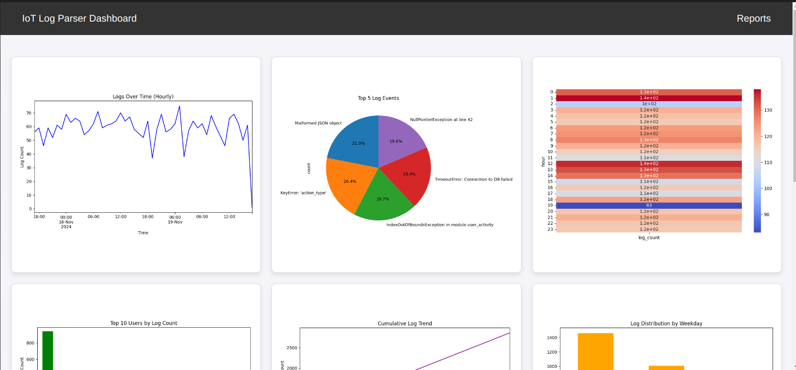
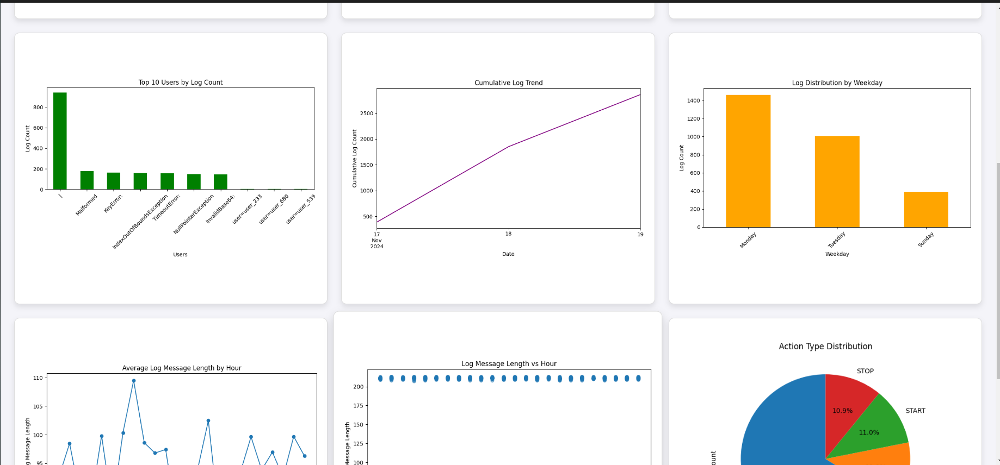
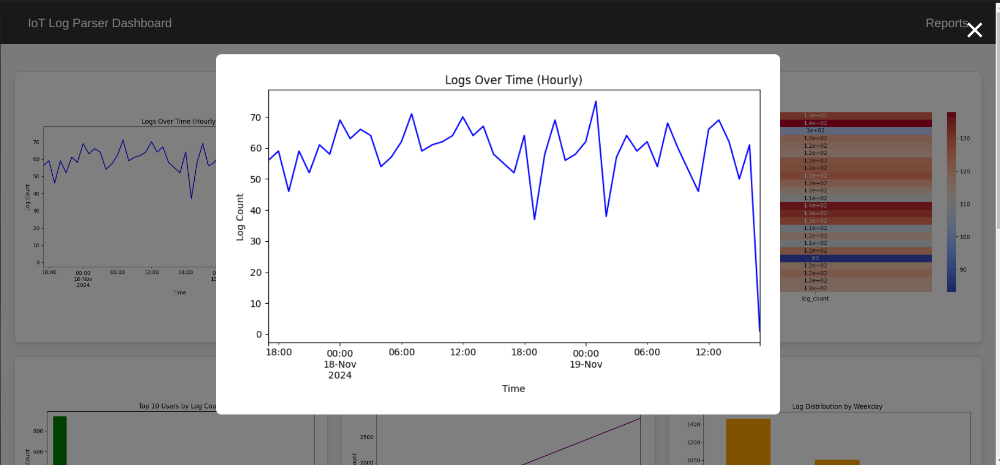
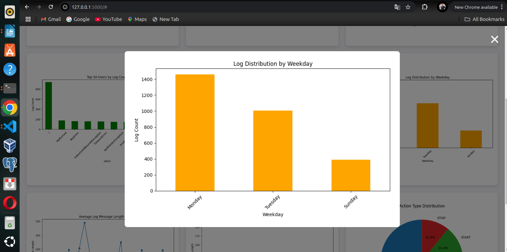

# IoT Log Parser and Dashboard

This project is a Flask-based log parser that processes log files, extracts meaningful insights, and generates visualizations for analysis.
## Installation Instructions/Setup

Follow these steps to set up and run the log parser:

### Prerequisites

Ensure you have the following dependencies installed:

- **Python 3.x**
- **Flask**
- **pandas**
- **matplotlib**
- **seaborn**

If you don't have these dependencies, you can install them using `pip`:

```bash
pip install flask pandas matplotlib seaborn
```

### File Structure

1. **/templates**: This folder contains the `dashboard.html` file that renders the visualizations.
2. **/app.py**: The main Flask application script.

The `output` folder is where all the generated images will be stored. Each plot will be saved in a separate folder (`output1`, `output2`, etc.).

### Setup

1. Clone or download this repository.
2. Ensure your log file is located at `/appdirectory/logs.txt` (you can change the path in the `parse_log_file` function).
3. Navigate to the project directory and run the application:

```bash
python app.py
```

This will start the Flask development server. Open your browser and navigate to `http://127.0.0.1:5000/` to view the dashboard.

## How to Run

Once the app is set up and running, follow these steps to run the log parser:

1. Place your log file in the specified location (`/yourapp/logs.txt`).
2. Start the Flask application by running:

   ```bash
   python app.py
   ```

3. Open your browser and go to `http://127.0.0.1:5000/` to see the log dashboard with visualizations.


## Screenshots

The following screenshots illustrate how the parser and dashboard look in action:

1. **Dashboard**  
   
   
   
     


## Customization

- You can modify the `parse_log_file()` function to process log files with different formats or from different locations.
- The `create_plot()` function allows for customization of plot types, titles, and other parameters.
- You can adjust the log file path in the `parse_log_file()` function to point to your own log file.
